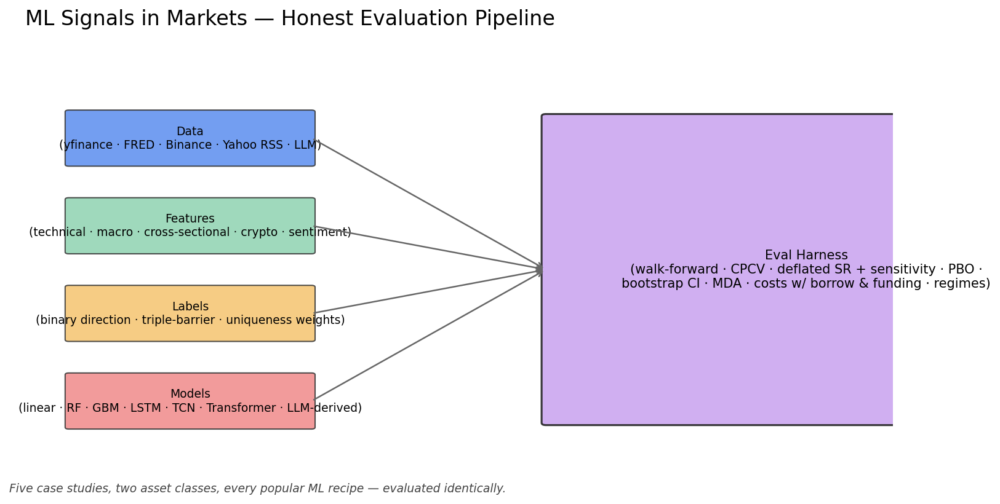

# ML Signals in Markets — An Honest Evaluation

[](https://github.com/rodme02/backtester/actions/workflows/ci.yml)
[](LICENSE)
[](https://www.python.org/)

> **Five case studies. Two asset classes. Every popular ML-trading recipe — gradient boosting, deep sequence models, LLM-derived sentiment, classical factor — evaluated through the same advanced harness with strong pragmatic discussion of every result.**



## Why this exists

Most "I trained ML to beat the market" projects ship the same three sins:

1. **Look-ahead leakage.** Features peek at information from after the prediction date.
2. **Single-split validation.** One train/test split, whatever Sharpe falls out, claim victory.
3. **Cosmetic costs.** Ignore commissions, half-spreads, market impact, borrow on shorts, funding payments on perps — the things that turn paper alpha into nothing.

Every signal in this repo is evaluated through the same harness:

- **Combinatorial Purged CV** ([López de Prado, AFML §12](https://www.wiley.com/en-us/Advances+in+Financial+Machine+Learning-p-9781119482086)) — one walk-forward path is a sample size of one. CPCV gives a *distribution* of OOS Sharpes (9 paths from `n_groups=10, k=2`).
- **Triple-barrier labels** with sample uniqueness weighting (AFML §3-4) — predictions are tied to actual trade outcomes (PT / SL / timeout), not abstract next-bar returns; overlapping labels are reweighted so 5-day-horizon training doesn't double-count.
- **Probability of Backtest Overfitting** ([Bailey-Borwein-LdP-Zhu 2017](https://papers.ssrn.com/sol3/papers.cfm?abstract_id=2326253)) — quantifies the chance the IS-best model regresses below OOS median.
- **Deflated Sharpe with sensitivity** ([Bailey & López de Prado 2014](https://papers.ssrn.com/sol3/papers.cfm?abstract_id=2460551)) — reported across `trials_sr_var ∈ {1.0, 0.5, 0.25, 0.1}` so the reader sees how the verdict moves with the trial-correlation assumption.
- **Stationary block bootstrap** (Politis-Romano 1994) for autocorrelated daily returns.
- **Asset-class-aware costs** *with* short-borrow on equities and dynamic funding payments on crypto perps. The cost-side of the carry trade is no longer ignored.
- **MDA permutation feature importance** (AFML §8.4) — model-agnostic, immune to high-cardinality bias.
- **Per-regime breakdown** (bull/bear via 200d SMA; high/low vol via expanding-quantile rolling stdev).

The conclusion most signals deserve is "the data doesn't support the claim." This project's framing tells that story honestly — *and* runs Jegadeesh-Titman 12-1 momentum (a known classical signal) through the same harness as a positive control to prove the methodology can identify edge when it exists.

## Planned scope — comprehensive empirical survey

Each case study answers a distinct research question:

| Case | Question | Asset | Status |
| --- | --- | --- | --- |
| 1 | Off-the-shelf tabular ML on equities — which family fails least? | US large-caps | GBM done; bake-off (linear/RF/MLP × binary/triple-barrier × with/without borrow) in progress |
| 2 | **Crypto signal universe — do funding-rate edges actually exist?** | Binance USDT perps | LSTM/TCN done; signal universe (carry rank · basis · positioning · premium) in progress |
| 3 | Sequence models on crypto — do recurrent / dilated-conv / attention architectures earn anything when fed the *right* features? | Binance USDT perps | LSTM/TCN done; Transformer + best-features in progress |
| 4 | LLM-derived news sentiment — does it add anything price-only features miss? | Equities + crypto | planned (Groq free tier) |
| 5 | **Positive control** — can the harness identify Jegadeesh-Titman 12-1 momentum? | US large-caps | planned (runs *first* to calibrate) |

Each case reports identical metrics for direct comparison. The cross-cutting writeup at [`docs/writeup.md`](docs/writeup.md) ties the survey together as a paper-lite (~4,000-word target).

## Status (current verdicts)

| Case | Model / signal | Asset | Net Sharpe | Deflated SR | Verdict |
| --- | --- | --- | --- | --- | --- |
| ✅ 1 | HistGradientBoosting | US equities | −0.428 | 0.000 | **FAIL** |
| ✅ 2 | LSTM (returns + funding) | Crypto perps | −1.348 | 0.000 | **FAIL** |
| ✅ 2 | TCN (returns + funding) | Crypto perps | +0.138 | 0.001 | **FAIL** |

Cases 1 and 2 will be re-executed once the v0.2 harness (CPCV + triple-barrier + sample weights + funding cost) is wired into the notebooks. Cases 3, 4, 5 follow.

## Quickstart

```bash
git clone https://github.com/rodme02/backtester.git
cd backtester
python -m venv .venv && source .venv/bin/activate
make install
make test
```

For live data, copy `.env.example` to `.env` and set:

- `FRED_API_KEY` — free at [fred.stlouisfed.org](https://fred.stlouisfed.org/) (macro features)
- `GROQ_API_KEY` — free tier at [groq.com](https://groq.com/) (LLM sentiment, Case 4)
- `OLLAMA_HOST` — optional, for local-LLM fallback on Apple Silicon / Linux

Yahoo Finance and Binance public endpoints need no key. CI runs against bundled fixtures (`BACKTESTER_FIXTURE_MODE=1`).

## Repo layout

```
src/backtester/
  data/         # csv_loader, yfinance, fred, binance, universe, news, llm
  eval/         # walkforward · CPCV · statistics (DSR sensitivity) · costs · regimes · PBO · MDA
  features/     # technical, macro, cross_sectional, crypto, sentiment
  labels/       # triple_barrier (PT/SL/timeout) + uniqueness weights
  models/       # linear, random_forest, gbm, sequence (LSTM / TCN / Transformer)
  portfolio/    # cross-sectional long/short construction + book costs
notebooks/      # 5 case studies (see notebooks/README.md)
docs/writeup.md # paper-lite empirical study (~4,000-word target)
samples/        # bundled OHLCV CSVs + universe snapshot + CI fixtures
tests/          # 90+ tests: leakage invariants, CPCV correctness, label semantics, costs, models
```

## Methodology references

- Bailey, D.H. & López de Prado, M. (2012). *The Sharpe Ratio Efficient Frontier.* Journal of Risk.
- Bailey, D.H. & López de Prado, M. (2014). *The Deflated Sharpe Ratio: Correcting for Selection Bias, Backtest Overfitting, and Non-Normality.* Journal of Portfolio Management.
- Bailey, D.H., Borwein, J.M., López de Prado, M., Zhu, Q.J. (2017). *The Probability of Backtest Overfitting.* Journal of Computational Finance.
- López de Prado, M. (2018). *Advances in Financial Machine Learning.* Wiley.
- Jegadeesh, N. & Titman, S. (1993). *Returns to Buying Winners and Selling Losers.* Journal of Finance.
- Politis, D.N. & Romano, J.P. (1994). *The Stationary Bootstrap.* Journal of the American Statistical Association.
- Schmeling, M., Schrimpf, A. & Todorov, K. (2023). *Crypto Carry.* BIS Working Paper 1087.

## Honest limitations

- Universe (`samples/universe_us_liquid.csv`) is hand-curated; not a true point-in-time index-membership feed.
- Daily bars only; no intraday microstructure.
- Cost model is per-asset-class average, not per-name spread/borrow/funding-rate at execution time.
- LLM sentiment uses a free-tier model; production research would benchmark against more powerful LLMs.
- Top-trader long/short ratios (Case 2) have a 30-day rolling history on Binance public REST; we collect them prospectively where possible but document the data gap.

## License

MIT — see [LICENSE](LICENSE).
